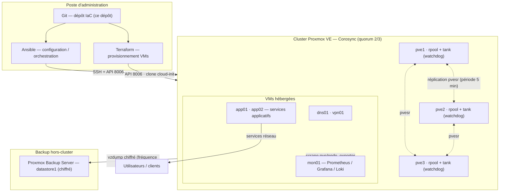

# Cluster Proxmox HA — Infrastructure as Code

Cluster local **haute disponibilité** à 3 nœuds Proxmox VE, provisionné avec **Terraform** et configuré/orchestré avec **Ansible**.

- Stockage : **ZFS local + réplication** (`pvesr`) par nœud — failover automatique via `ha-manager`
- Bascule : watchdog + HA Manager (redémarrage du VM sur le nœud réplica)
- Sauvegarde : Proxmox Backup Server (PBS) dédié
- Supervision : Prometheus + Grafana + Loki

## Stack technique

   

  

    

   

[🔗 Liens officiels (downloads & docs)](#liens-officiels-téléchargements-et-documentation)

## Table des matières

| Doc | Sujet |
|---|---|
| [`requirements.md`](requirements.md) | Prérequis matériel, réseau, versions logicielles |
| [`docs/01-architecture.md`](docs/01-architecture.md) | Architecture cible et choix techniques justifiés |
| [`docs/03-installation-noeuds.md`](docs/03-installation-noeuds.md) | Installation des nœuds PVE de A à Z (liens officiels) |
| [`docs/04-cluster-zfs-replication.md`](docs/04-cluster-zfs-replication.md) | Création du cluster, ZFS, réplication |
| [`docs/05-terraform.md`](docs/05-terraform.md) | Provisioning des VMs avec Terraform |
| [`docs/06-ansible.md`](docs/06-ansible.md) | Configuration et orchestration avec Ansible |
| [`docs/07-ha.md`](docs/07-ha.md) | Haute disponibilité (HA Manager, affinités, watchdog) |
| [`docs/08-reseau-dns-vlan.md`](docs/08-reseau-dns-vlan.md) | Réseaux, VLANs, DNS interne (`cluster.local`) |
| [`docs/09-securite.md`](docs/09-securite.md) | Durcissement, firewall, TOTP, secrets |
| [`docs/10-monitoring.md`](docs/10-monitoring.md) | Supervision, logs centralisés, alertes |
| [`docs/11-backup-restore.md`](docs/11-backup-restore.md) | PBS : sauvegarde, chiffrement, restauration |
| [`docs/12-tests-failover.md`](docs/12-tests-failover.md) | Tests de bascule et reprise après incident |
| [`docs/13-procedures-exploitation.md`](docs/13-procedures-exploitation.md) | Procédures d'exploitation + index des runbooks |
| [`docs/runbooks/`](docs/runbooks) | Runbooks d'intervention (incident, maintenance, upgrade…) |
| [`docs/templates/`](docs/templates) | Checklists de validation et fiches de test |

## Vue d'ensemble (flux du projet)



## Architecture en une page

```
                     Réseau Management 192.168.1.0/24
                     Réseau Corosync    10.10.0.0/24  (dédié, basse latence)
                     Réseau VM          10.10.10.0/24
                     Réseau Backup      10.10.30.0/24  (PBS)

   ┌───────────────────────────────┐
   │  pve1 · pve2 · pve3           │  Cluster Corosync (quorum 2/3)
   │  ├─ ZFS rpool local (OS)      │
   │  ├─ ZFS pool data (VMs)       │  ← les disques VM sont répliqués (pvesr)
   │  └─ watchdog (self-fencing)   │     vers UN ou DEUX nœuds voisins
   └───────────────────────────────┘
          ▲  ha-manager bascule la VM sur le nœud réplica
          │
   ┌──────┴──────────┐   ┌──────────────────┐   ┌───────────────────┐
   │ PBS (VM/VPS)    │   │ Monitoring       │   │ DNS + VPN +       │
   │ sauvegardes     │   │ Prom/Grafana/Loki│   │ services applic.  │
   └─────────────────┘   └──────────────────┘   └───────────────────┘
```

**Point clé** : la disponibilité est assurée par la **réplication ZFS asynchrone** (`RPO = intervalle de réplication`, ex. 5 min). En cas de perte d'un nœud, les écritures postérieures au dernier snapshot répliqué sont perdues. Le HA protège contre une panne matérielle — **pas** contre une suppression/ransomware : c'est le rôle de PBS (voir doc 11).

## Démarrage rapide

```bash
# 1. Sur le poste d'administration : installer les dépendances
ansible-galaxy collection install -r ansible/requirements.yml
terraform init                                                  # dans terraform/

# 2. Provisionner les 3 nœuds (docs 03 et 04)
#    (installation ISO manuelle + pvecm + ZFS + pvesr)

# 3. Configurer le cluster avec Ansible (vault requis pour les secrets)
cd ansible
ansible-playbook -i inventory.yml playbooks/site.yml --ask-vault-pass

# 4. Provisionner les VMs avec Terraform
cd ../terraform
terraform apply
```

## Liens officiels (téléchargements et documentation)

| Ressource | URL |
|---|---|
| Proxmox VE (ISO) | <https://www.proxmox.com/en/downloads/proxmox-virtual-environment/iso> |
| Proxmox VE — doc HA | <https://pve.proxmox.com/wiki/High_Availability> |
| Proxmox VE — Cluster Manager | <https://pve.proxmox.com/pve-docs/chapter-pvecm.html> |
| Proxmox VE — Storage Replication | <https://pve.proxmox.com/pve-docs/chapter-pvesr.html> |
| Proxmox Backup Server (ISO) | <https://www.proxmox.com/en/downloads/proxmox-backup-server/iso> |
| Proxmox Backup Server — doc | <https://pbs.proxmox.com/wiki/> |
| Terraform (binaire) | <https://developer.hashicorp.com/terraform/downloads> |
| Terraform — backends/state | <https://developer.hashicorp.com/terraform/language/state/backends> |
| Provider `bpg/proxmox` | <https://registry.terraform.io/providers/bpg/proxmox/latest> |
| Ansible (installation) | <https://docs.ansible.com/ansible/latest/installation_guide/intro_installation.html> |
| Collection `community.proxmox` | <https://docs.ansible.com/ansible/latest/collections/community/proxmox/index.html> |
| Images cloud Ubuntu | <https://cloud-images.ubuntu.com/> |

## Convention de valeurs (toutes configurables dans `inventory.example.yml`)

| Paramètre | Valeur d'exemple |
|---|---|
| Domaine interne | `cluster.local` |
| Nœuds | `pve1` `pve2` `pve3` |
| Réseau Management | `192.168.1.0/24` — `pve1`=`.10` `pve2`=`.11` `pve3`=`.12` |
| Réseau Corosync | `10.10.0.0/24` — `.1` `.2` `.3` |
| Réseau VM | `10.10.10.0/24` — passerelle `.1` |
| Réseau Backup | `10.10.30.0/24` — PBS `.10` |
| Pool ZFS data | `tank` (p. ex. `tank/vm`) |
| IDs VM Terraform | réservés `100–299` |
| Templates cloud-init | VM ID `9000` (Ubuntu), `9001` (Debian) |

## Arborescence du dépôt

```
cluster_proxmox/
├── README.md
├── requirements.md
├── inventory.example.yml          # modèle d'inventaire Ansible (IPS, VLANs, secrets via vault)
├── docs/                          # toute la documentation (voir tableau ci-dessus)
├── terraform/                     # provisioning des VMs (doc 05)
│   ├── versions.tf  provider.tf  variables.tf  99-vms.tf  outputs.tf
│   ├── terraform.tfvars.example   # → copier en terraform.tfvars (gitignoré)
│   └── state / backend distant (S3/MinIO) + locking
└── ansible/                       # configuration du cluster (doc 06)
    ├── ansible.cfg  requirements.yml  inventory.yml
    ├── group_vars/all/            # vars.yml (public) + vault.yml (chiffré)
    ├── playbooks/                 # 00-cluster … 04-services + site.yml
    └── roles/                     # base, cluster, storage, monitoring, services
```

> Les dossiers `terraform/` et `ansible/` contiennent du **code exécutable de référence** aligné sur les
> docs 05 et 06 (pipe de IaC). `terraform.tfvars` et `group_vars/all/vault.yml` sont gitignorés : ils
> portent les secrets (tokens API, mots de passe) et restent hors du dépôt.

## Statut du projet

Phase du déploiement : **0 Prérequis / 1 Installation** (projet sur papier → à implémenter nœud par nœud).
Suivez l'ordre des docs (`01 → 03 → 04 → 05 → 06 → 07 → 08 → 09 → 10 → 11 → 12 → 13`) puis exécutez les runbooks.
Le code IaC (`terraform/`, `ansible/`) est fourni et aligné sur ces docs ; il ne cible que les VMs/état
**post-installation** des nœuds PVE (phase 05/06 du schéma).